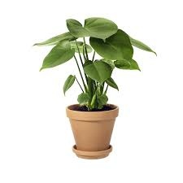

# Grupp 5

## Introduktion
En fuktsensor för att mäta fuktnivån i blomkrukor som hjälper användare med när de ska vattnas, och för att avgöra om jorden är torr, lagom fuktig eller vattenmättad.

Det kan även vara bra att mäta temperatur eftersom den kan påverka fuktnivån i jorden.

## Användare

* Personer som har växter, hemma, på jobbet, eller i sina fritidshus.
* Säljare i växtbutiker med växthus.
* Personer som vill ha växter men inte har kunskap om dem.
* Jordbrukare och Koloniägare.

## Kontext

Användningen av vår lösning är oftast i hemmet nära växten, på en telefon, utan stress.

## Visualisering

En progress bar för en enskild kruka för att se fuktnivån för tillfället och ett diagram för att se trender för fukten genom tid.

